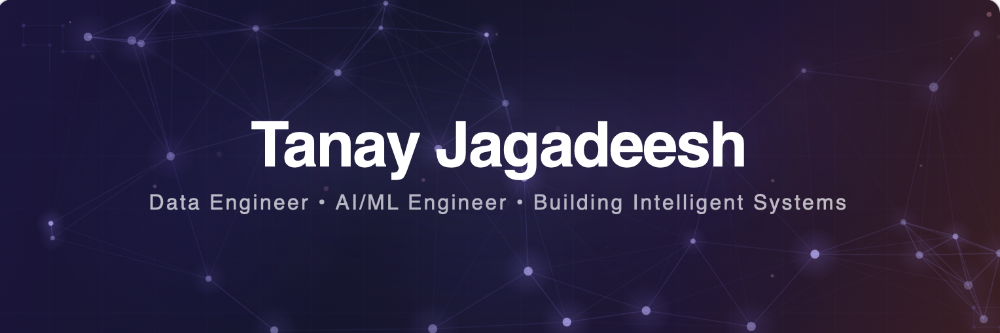

  

---

 &nbsp;LLM Research with **Prof. Roberto Foa** (University of Cambridge)

 &nbsp;Building **voice agents** and a **referral pipeline** with [Wedge (YCS25)](https://www.ycombinator.com/companies/wedge) and Dr. Guha Roy

 &nbsp;**AI/ML Engineer** @ IntoTheOpen

 &nbsp;**Incoming Data Science Intern** @ Workplace Safety and Insurance Board (WSIB)

 &nbsp;Won **Canada's largest Data + AI hackathon** — CXC ($1,000 prize, 350+ participants)

---

## Let's Connect

### Always down to collaborate, build, or just chat.

  
  &nbsp;
  
  &nbsp;
  
  &nbsp;
  

